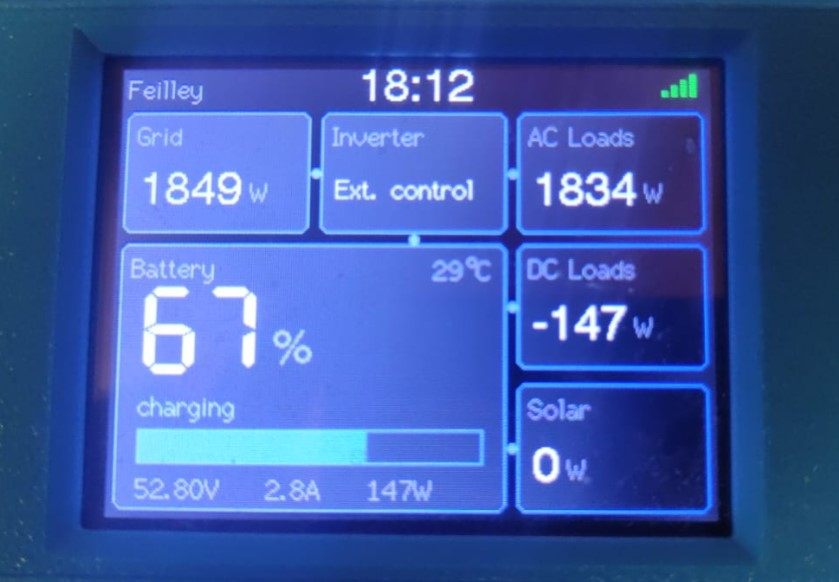

# ESP32-Victron-VRM-Display

A live **Victron energy-flow dashboard** on the **ESP32-2432S028R** — the cheap 2.8" touch
TFT board widely known as the **"Cheap Yellow Display" (CYD)**.

It reproduces the Victron tile view — **Grid · Inverter · AC Loads · Battery · DC Loads · Solar** —
on a board that costs ~€10. No Raspberry Pi, no broker.



## Two versions (pick one)

| | **VictronCYD** (VRM cloud) | **VictronCYD_Modbus** (realtime) ⭐ |
|---|---|---|
| Data source | Victron **VRM API** (cloud) | **GX device** on your LAN via **Modbus TCP** |
| Refresh | ~20 s (VRM logs every ~60 s) | **~2 s, true realtime** |
| Needs internet | Yes | **No** (local network only) |
| Needs a token | Yes (VRM Personal Access Token) | **No** |
| Needs a GX (Cerbo/Venus) on LAN | No (works remotely) | Yes |
| Library deps | TFT_eSPI, ArduinoJson, StreamUtils | **TFT_eSPI only** |

**Use Modbus** if your GX is on the same network (instant, offline-capable). **Use VRM cloud**
if you want to watch a site you're not on the same network as.

## Features

- Live **Grid / AC Loads / DC Loads / Solar (PV)** power and **Inverter state**
- **Battery**: SoC %, charge bar, state, voltage / current / power, temperature
- Energy-flow connectors, Victron-style dark theme, NTP clock, WiFi indicator
- Credentials kept out of git via `secrets.h`

## Hardware

- **ESP32-2432S028R** (CYD) — ILI9341 240×320 TFT
- Micro-USB cable, 2.4 GHz WiFi (the ESP32 has no 5 GHz)
- For the Modbus version: a **Victron GX device** (Cerbo GX / Venus OS) reachable on your LAN

## 1. Configure TFT_eSPI for the CYD

Both versions need TFT_eSPI set up for the CYD. Put this in `User_Setup.h` (or a custom
`User_Setups/Setup_CYD.h` selected in `User_Setup_Select.h`):

```c
#define ILI9341_2_DRIVER        // if the screen stays blank, try #define ILI9341_DRIVER
#define TFT_WIDTH  240
#define TFT_HEIGHT 320
#define TFT_MISO 12
#define TFT_MOSI 13
#define TFT_SCLK 14
#define TFT_CS   15
#define TFT_DC    2
#define TFT_RST  -1
#define TFT_BL   21
#define TFT_BACKLIGHT_ON HIGH
#define LOAD_GLCD
#define LOAD_FONT2
#define LOAD_FONT4
#define LOAD_FONT6
#define LOAD_FONT7
#define LOAD_FONT8
#define LOAD_GFXFF
#define SMOOTH_FONT
#define SPI_FREQUENCY       55000000
#define SPI_READ_FREQUENCY  20000000
#define SPI_TOUCH_FREQUENCY  2500000
```

> **Colors inverted / black shows as white?** Some CYD panels are inverted. Both sketches call
> `tft.invertDisplay(true)`. If your colors look wrong, change it to `false`.

## 2a. Realtime version (VictronCYD_Modbus) — recommended

1. On the GX: **Settings → Services → Modbus TCP = ON**. Note the GX IP address
   (Settings → Ethernet/WiFi).
2. `cd VictronCYD_Modbus && cp secrets.example.h secrets.h`, then set WiFi, `SECRET_GX_IP`,
   `SECRET_SITE_NAME`.
3. Flash. Done — updates every ~2 s, no token, works offline.

**GX Modbus register map used** (function 3, read holding registers):

| Value | Unit id | Register | Scale |
|---|---|---|---|
| AC Loads (W) | 100 | 817 | ×1 |
| Grid (W) | 100 | 820 | ×1, signed |
| Battery voltage | 100 | 840 | ÷10 |
| Battery current | 100 | 841 | ÷10, signed |
| Battery power (W) | 100 | 842 | ×1, signed |
| Battery SoC (%) | 100 | 843 | ×1 |
| Battery state | 100 | 844 | 0 idle / 1 charging / 2 discharging |
| PV power (W) | 100 | 850 | ×1 |
| DC system (W) | 100 | 860 | ×1, signed |
| VE.Bus state | 228 | 31 | enum |
| Battery temperature | 225 | 262 | ÷10 |

> Unit ids can differ per installation (especially 225/228). If battery temp or inverter state
> read wrong, check your GX's CCGX Modbus-TCP register list for the right unit ids.

## 2b. VRM cloud version (VictronCYD)

1. **VRM Personal Access Token** — VRM Portal → *Preferences → Integrations → Access tokens*.
2. **Installation id (`idSite`)** — in the VRM URL, or:
   `GET https://vrmapi.victronenergy.com/v2/users/{idUser}/installations`
   with header `x-authorization: Token <token>`.
3. `cd VictronCYD && cp secrets.example.h secrets.h`, fill in the values.

## 3. Build & flash

**Arduino IDE:** open the `.ino`, select *ESP32 Dev Module*, Upload.

**arduino-cli:**
```bash
arduino-cli compile --fqbn esp32:esp32:esp32 VictronCYD_Modbus
arduino-cli upload  --fqbn esp32:esp32:esp32 -p COM3 VictronCYD_Modbus   # your port
```

---

## Technical notes (VRM cloud version)

Reading the VRM **`/diagnostics`** endpoint on an ESP32 is the tricky bit — ~129 KB of JSON over
HTTPS. Three things are needed together:

1. **`http.useHTTP10(true)`** — otherwise the response is *chunked* and ArduinoJson reads the
   first hex chunk-size as a JSON number, "succeeds", and returns **0 records**.
2. **ArduinoJson `Filter`** — the full body won't fit in RAM; the filter keeps only the ~12 codes
   needed while streaming.
3. **A blocking `Stream` wrapper** — the default `Stream::read()` is non-blocking and returns -1
   between TLS records, so ArduinoJson stops at the first ~16 KB. The `BlockingStream` waits for
   more bytes until the connection truly closes.

Auth header: **`x-authorization: Token <PAT>`** (`Bearer` returns 401). VRM diagnostics codes:
`g1` grid, `a1` AC loads, `dc` DC, `bv`/`bc`/`bp` battery V/A/W, `bs` SoC, `bT` temp,
`bst` battery state, `ss` system state, `PVP` PV.

## Notes (Modbus version)

The Modbus client keeps one TCP connection open. To avoid the buffer desync that can freeze the
display, `mbRead()` drains stale bytes before each request, validates the response transaction id,
and **closes the socket on any error** so the next read reconnects and re-syncs automatically.

## Credits

Built for the ESP32-2432S028R "Cheap Yellow Display". Uses the
[Victron VRM API](https://vrm-api-docs.victronenergy.com/) and the GX Modbus-TCP interface.
Not affiliated with Victron Energy.

## License

MIT — see [LICENSE](LICENSE).
